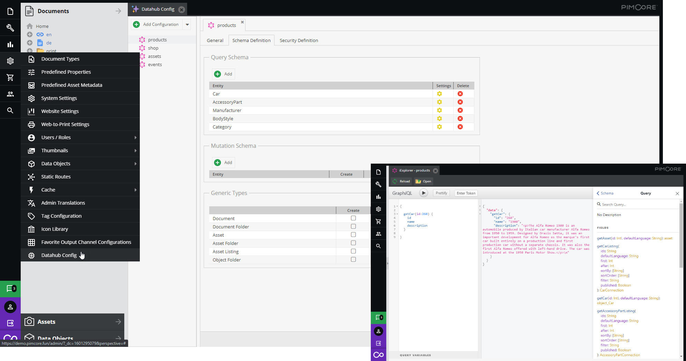

# Pimcore Datahub

Pimcore Datahub (data delivery and consumption platform) integrates different input & output channel
technologies into a simple & easy-to-configure system on top of Pimcore.

The basic configuration of Datahub comes with a GraphQL API, which is described in the next sections of this documentation. To use another configuration, Pimcore Datahub can be extended with different adapters (see [Further Information](#further-information)).

*Sample presentation of Datahub config when choosing the GraphQL endpoint*

A short introduction video of an output channel based on the GraphQL query language can be found [here](./doc/img/graphql/intro.mp4).

## Features in a Nutshell
- Easy-to-configure interface layer for data delivery and consumption
- Tool of choice to connect Pimcore to any other systems and applications besides internal PHP API - whether they are backend applications like ERP systems or frontend applications like your storefront
- Multiple endpoints definition for different use cases and target/source systems
- Central and easy-to-use GUI to transform and prepare data for defined endpoints
- To-be-exposed data restriction to endpoints by defining workspaces and schemas.

## Documentation Overview
- [Installation](./doc/01_Installation_and_Upgrade/README.md)
- [Basic principle](./doc/02_Basic_Principle.md) for configuring an endpoint
- [GraphQL](./doc/10_GraphQL/README.md) [*default and recommended endpoint*]
- [Configuration & Deployment](./doc/20_Deployment.md)
- [Testing](./doc/30_Testing.md)

## Further Information
On Pimcore Datahub adapters:
- [Datahub Simple Rest API](https://pimcore.com/docs/platform/Datahub_Simple_Rest/)
- [Datahub File Export](https://pimcore.com/docs/platform/Datahub_File_Export/)
- [Datahub Productsup](https://pimcore.com/docs/platform/Datahub_Productsup/)
- [Datahub CI Hub](https://pimcore.com/docs/platform/Datahub_CI_Hub/)
  
## Contributions
As Pimcore Datahub is a community project, any contributions highly appreciated.
For details see our [Contributing guide](https://github.com/pimcore/data-hub/blob/master/CONTRIBUTING.md).
