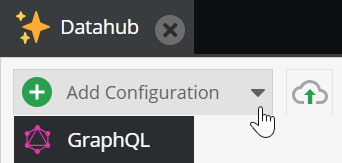

# Data Hub Bundle

## Minimum Requirements

* Pimcore >= 5.7

## Install
```bash 
composer require pimcore/data-hub
```

## Supported Channels

*  **[GraphQL](doc/GraphQL.md)**
*  CSV/XLS (coming soon...)
*  webservice (coming soon...)
* ...

## Adding a new configuration


Choose the channel type



And get the configuration done

Example for [GraphQL](doc/GraphQL.md)

## Required Backend User Permission

Either:
* `admin` role or
* `plugin_datahub_config`