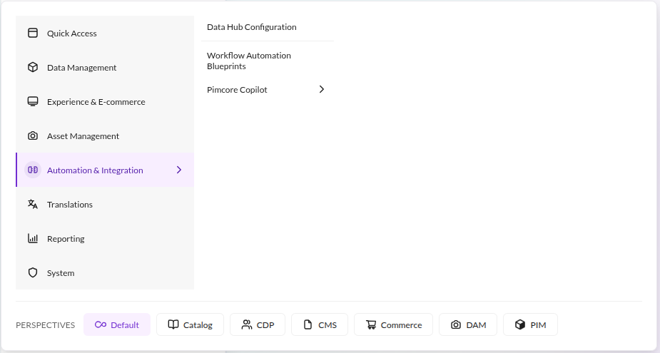
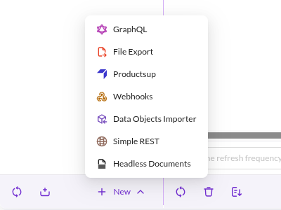

# Basic Principle

Datahub delivers and consumes data through **endpoints**. An endpoint is described by a **configuration**, and a Pimcore
installation can hold as many configurations as it needs, each serving a different target system or use case.

Every configuration names an **endpoint technology**, the adapter that implements the protocol. GraphQL ships with
Datahub and is the default. Further adapters, such as Datahub Simple REST, Datahub File Export and Datahub Webhooks,
are available as separate bundles.

## Adding a New Configuration

1. In Pimcore Studio, open the main navigation and choose **Automation & Integration** > **Datahub Configuration**.

2. Add a configuration and choose an endpoint technology.

3. Complete the configuration:

- **General settings**: name, description and the state of the endpoint.
- **Schema configuration**: the data the endpoint exposes.
- **Security definitions**: who may call the endpoint, and which elements they reach.
- **Additional settings**: adapter-specific options.

The exact tabs depend on the adapter. For the GraphQL adapter, see [GraphQL](./10_GraphQL/README.md).

## Restricting the Exposed Data

Two mechanisms narrow what an endpoint reaches:

- **Schemas** decide which classes, fields and element types are part of the endpoint at all.
- **Workspaces** decide which parts of the Asset, Document and Data Object trees the endpoint may read and write.

Workspace permissions are also kept in a database index for query performance. After deploying a configuration file,
rebuild that index. See [Configuration & Deployment](./20_Deployment.md).
