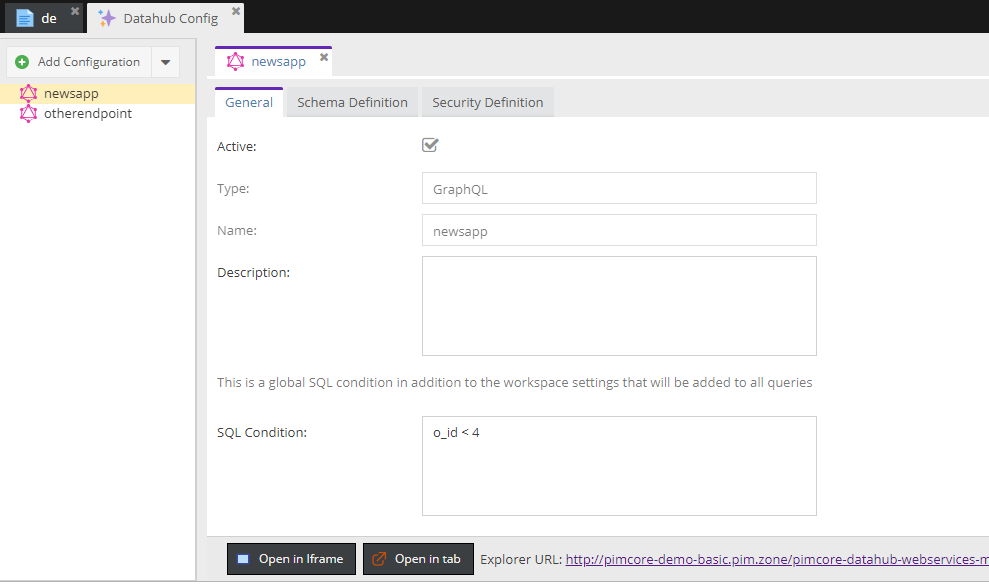

# General Settings

#### Some Aspects:
* `Active`: You can temporarily disable the configuration using the checkbox.
* `SQL Condition`: You can add a condition all data object queries have to satisfy in addition to 
  the [workspace settings](./03_Security_Settings.md).