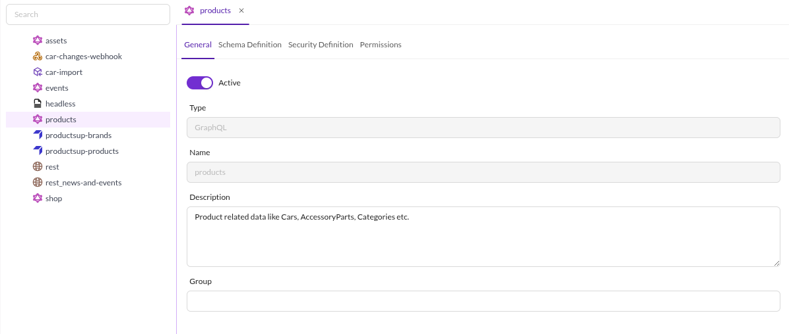

# General Settings

The **General** tab holds the basic settings of the endpoint:

- `Active`: enable or disable the configuration. Only active configurations serve requests.
- `Type` and `Name`: set when the configuration is created and shown read-only here.
- `Description`: free text describing the endpoint.
- `Group`: groups configurations in the Datahub tree on the left.

:::note

The `SQL Condition` field was removed in Datahub 2.0.0. Restrict data object queries through
[workspace settings](./03_Security_Settings.md) instead.

:::
