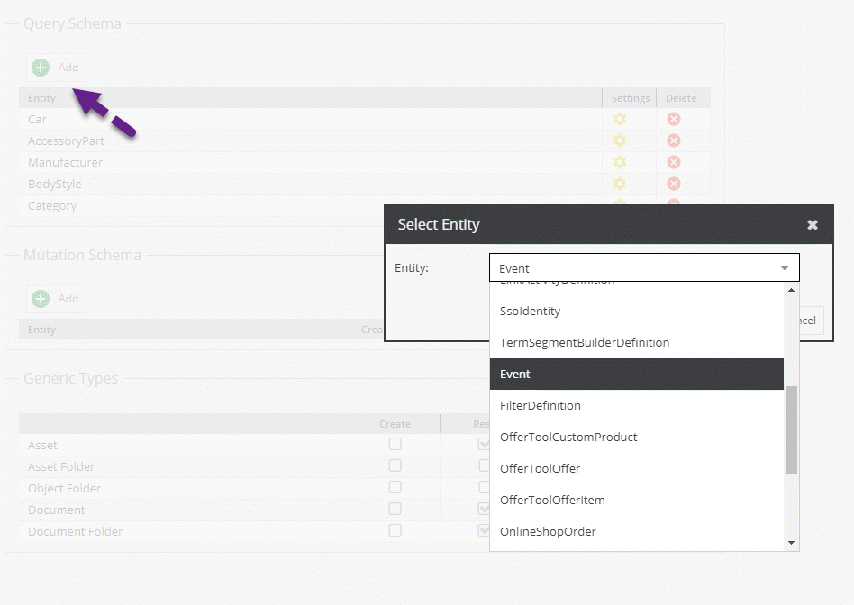
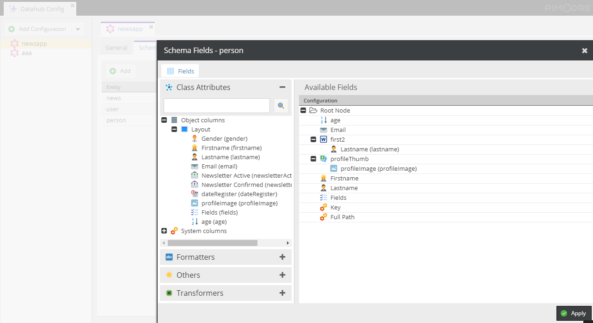

# Schema Settings

Schema settings define which data entities (Data Object classes, Assets, Documents) should be exposed via the endpoint. For Assets and Documents, default schemas are provided, for Data Object classes the schema can be defined in the field configuration.

## Query Schema

Here you can configure which Data Objects Classes can be exposed. 

### Available Fields Configuration

When adding a new entity with the `Add` button, you can access the `Available Fields Configuration` window with a right-click on the `Settings` icon. You can then define all the target Data Object Class fields you want to make available.

In addition, you can employ a set of operators.

Please note that not all data types are supported yet!
You will get a notice if you try to add an unsupported data type.

## Mutation Schema

Here you can decide if Data Objects for the selected class can be created, updated or deleted from the endpoint.

:::caution

Be aware that a Data Object deleted from an endpoint will be definitively deleted of Pimcore.

:::

### Available Fields Configuration

As for the `Query Schema` field, you can select the fields you want to expose and/or make available for changes in the `Available Fields Configuration` you can open by clicking on the `Settings` icon.
 
## Generic Types

Here you can define which data types can be created, read, updated or deleted from an endpoint.

