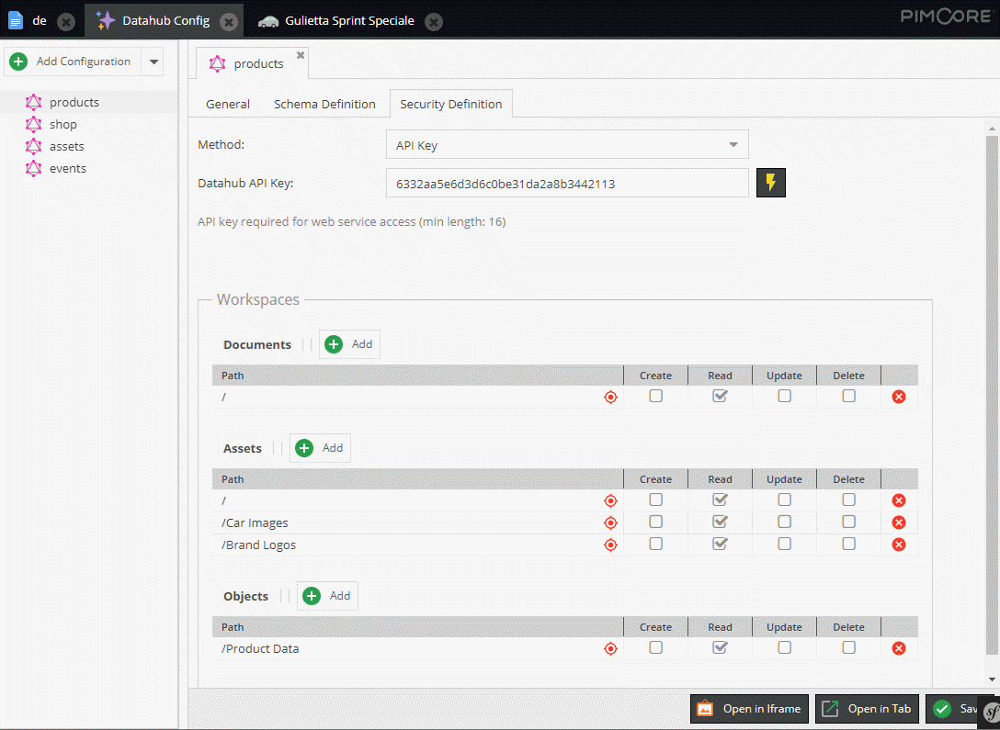

# Security Settings

## Authentication

Here you can define how users are authenticated when accessing the endpoint.

#### Supported Methods

* API Key: needs to be sent with every request.
* ... more to come

## Introspection Settings

Introspection provides an information about queries which are supported by GraphQl schema. This is currently enabled by default. It can be disabled via security settings or in the symfony configuration tree:
```
pimcore_data_hub:
    graphql:
        allow_introspection: false
```

## Workspace Settings

Defines workspaces for data that should be accessible via the endpoint. 
The definition is similar to Pimcore user [workspace permissions](https://pimcore.com/docs/6.x/Development_Documentation/Administration_of_Pimcore/Users_and_Roles.html) 

Available permissions:
* Create
* Read
* Update
* Delete




## Error Handling  - Configuration Values

The default behavior for associated/related objects, documents or assets that are not visible for the
endpoint is, to simply null it out.

You can change that via a configuration setting in symfony configuration tree:
* 1 = the entire query will fail
* 2 = null it out/skip it for multi-relations (default)
 
```
pimcore_data_hub:
    graphql:
        not_allowed_policy: 2
```

It is also possible to disable the permission checks entirely by setting the configuration option
in the security definition tab.
