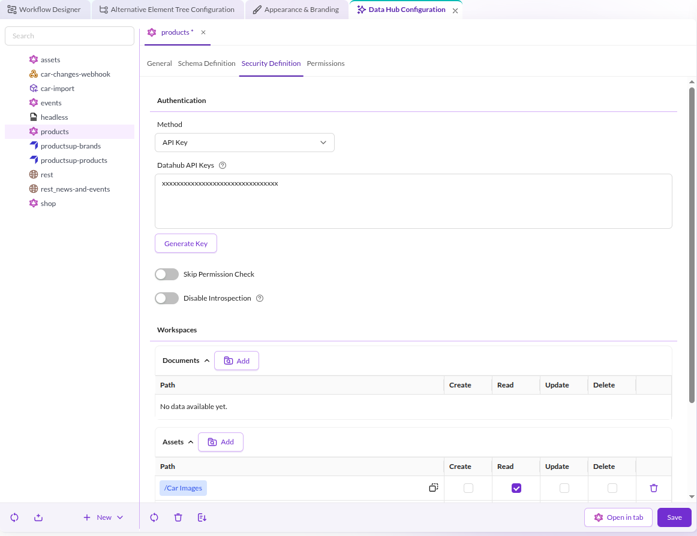

# Security Settings

The security settings define how the endpoint is secured and which data is accessible.

<div class="image-as-lightbox"></div>



## Authentication

The `Method` defines how requests to the endpoint are authenticated.

#### Supported Methods

* API Key: needs to be sent with every request.

#### API Key

Use **Generate Key** to create an API key. Each click generates a new key and adds it to the **Datahub API Keys**
field alongside any existing keys.

#### Skip Permission Check

The **Skip Permission Check** toggle disables the workspace permission checks entirely for this endpoint.

## Introspection Settings

Introspection provides an information about queries which are supported by GraphQl schema. 
If introspection is enabled, the endpoint will provide a schema definition which can be used by GraphiQL or other tools to provide auto-completion and documentation.
If introspection is disabled, the schema definition will not be provided and therefore no auto-completion or documentation will be available.

Introspection is enabled by default. Disable it with the **Disable Introspection** toggle on this tab, or in the Symfony
configuration tree:
```
pimcore_data_hub:
    graphql:
        allow_introspection: false
```

## Workspace Settings

Defines workspaces for data that should be accessible via the endpoint.
The definition is similar to Pimcore user [workspace permissions](https://github.com/pimcore/studio-ui-bundle/blob/2026.x/doc/03_Configuration_and_Administration/02_Users_and_Roles/README.md).

:::warning

If no workspace is selected, no directories are accessible.

:::

Available permissions:
* Create
* Read
* Update
* Delete


## Error Handling  - Configuration Values

The default behavior for associated/related objects, documents or assets that are not visible for the
endpoint is, to simply null it out.

You can change that via a configuration setting in symfony configuration tree:
* 1 = the entire query will fail
* 2 = null it out/skip it for multi-relations (default)
 
```
pimcore_data_hub:
    graphql:
        not_allowed_policy: 2
```

It is also possible to disable the permission checks entirely by setting the configuration option
in the security definition tab.
