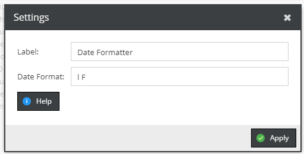
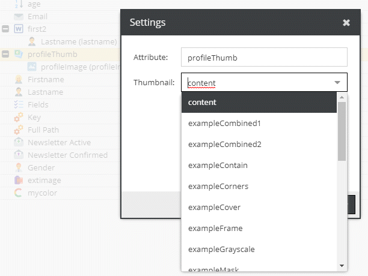
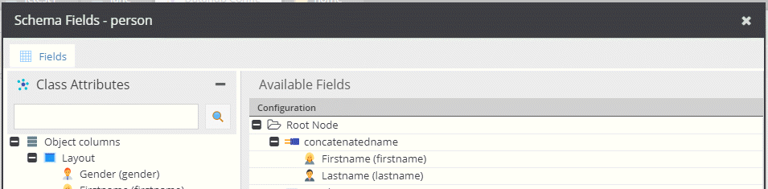
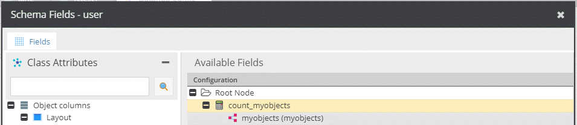

# Query Operators

Operators allow to modify and transform the data before it is delivered to the endpoint. 


#### Alias

Simply gives the child node a different name.

#### Date Formatter

Utilizes the PHP date formatter.



#### Asset Thumbnail

Returns the thumbnail URL of the assigned image.



#### Asset Thumbnail HTML

Returns the thumbnail HTML tag of the assigned image.


#### Concatenator

Concatenates the child values.



Request:
```
{
  getPerson(id: 28) {
    concatenatedname
  }
}
```

```
{
  "data": {
    "getPerson": {
      "concatenatedname": "John Doe"
    }
  }
}
```


####  Element Counter

Counts the child elements.



Request:
```
{
  getUser(id: 50, defaultLanguage: "de") {
    count_myobjects
  }
}

```

Response:
```
{
  "data": {
    "getUser": {
      "count_myobjects": 2
    }
  }
}
```


#### Merge

...

#### Substring

As the name says.

#### Static Text

Adds some static text.

#### Translate Value

Similar to Pimcore's [Translate Value](https://pimcore.com/docs/6.x/User_Documentation/DataObjects/Grid_Configuration_Operators/Operators/TranslateValue.html). 
For an example see [Website Translations](./11_Query_Samples/27_Sample_Translate_Values.md)

#### Trimmer

As the name says.
