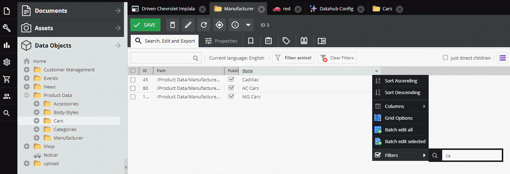

# Filter Listings

You can use __Pimcore's webservice filter logic__
as described [here](https://pimcore.com/docs/pimcore/6.9/Development_Documentation/Web_Services/Query_Filters.html)
to filter listing.


## Sample
Get all `Manufacturer` objects which have 'ca' in their name field. 




#### Request
```graphql
{
  getManufacturerListing(filter: "{\"name\": {\"$like\" :\"%ca%\"}}") {
    edges {
      node {
        id
        name
      }
    },
    totalCount    
  }
}
```

#### Response
```json
{
  "data": {
    "getManufacturerListing": {
      "edges": [
        {
          "node": {
            "id": "45",
            "name": "Cadillac"
          }
        },
        {
          "node": {
            "id": "80",
            "name": "AC Cars"
          }
        },
        {
          "node": {
            "id": "153",
            "name": "MG Cars"
          }
        }
      ],
      "totalCount": 3
    }
  }
}
```


