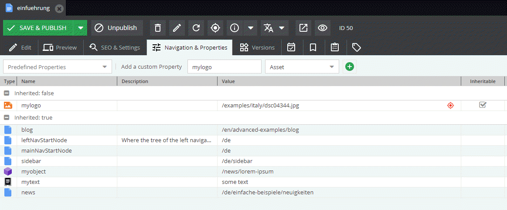

# Get Element Properties



### Request

Properties can be filtered by providing the `keys` argument. All properties will be returned by default.

```graphql
{
  getDocument(id: 38) {
    ... on document_page {
      fullpath
      properties(keys: ["newsletter_confirm_mail", "myobject", "mylogo"]) {
        __typename
        ... on property_text {
          name
          text
        }
        ... on property_select {
          name
          text
        }
        ... on property_document {
          name
          type
          document {
            __typename
            ... on document_email {
              id
              fullpath
              controller
              action              
            }
          }
        }
        ... on property_asset {
          name
          asset {
            fullpath
            logothumb: fullpath(thumbnail: "content")
            filesize
          }
        }
        ... on property_object {
          name
          object {
            ... on object_Car {
              id
              name
              color
            }
          }
        }
      }
    }
  }
}
```

### Response

```json
{
  "data": {
    "getDocument": {
      "fullpath": "/en/More-Stuff/Developers-Corner/Editable-Roundup",
      "properties": [
        {
          "__typename": "property_document",
          "name": "newsletter_confirm_mail",
          "type": "document",
          "document": {
            "__typename": "document_email",
            "id": "105",
            "fullpath": "/en/mails/newsletter_confirm",
            "controller": "@AppBundle\\Controller\\DefaultController",
            "action": "genericMail"
          }
        },
        {
          "__typename": "property_asset",
          "name": "mylogo",
          "asset": {
            "fullpath": "/Brand%20Logos/Alfa_Romeo_logo.png",
            "logothumb": "/Brand%20Logos/image-thumb__290__content/Alfa_Romeo_logo.webp",
            "filesize": 101613
          }
        },
        {
          "__typename": "property_object",
          "name": "myobject",
          "object": {
            "id": "273",
            "name": "Gulietta Sprint Speciale",
            "color": [
              "green"
            ]
          }
        }
      ]
    }
  }
}
```
