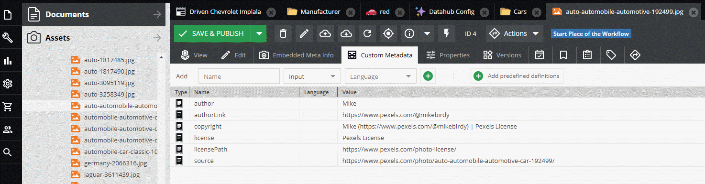
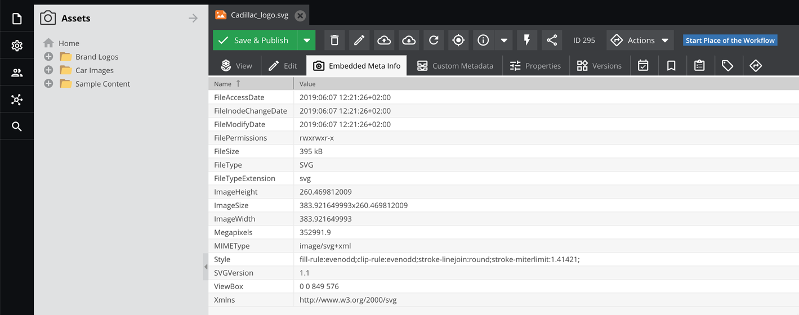

# Get Asset Metadata



Deeplink: [http://pimcore-demo-basic.pim.zone/admin/login/deeplink?asset_4_image](http://pimcore-demo-basic.pim.zone/admin/login/deeplink?asset_4_image)

### Request

Get the custom asset metadata for language `de`

```graphql
{
  getAsset(id: 4, defaultLanguage: "de") {
    id
    fullpath
    type
    mimetype
    filesize
    metadata {
      name
      type
      data
      language
    }
  }
}
```

### Response

```json
{
  "data": {
    "getAsset": {
      "id": "4",
      "fullpath": "/Car%20Images/jaguar/auto-automobile-automotive-192499.jpg",
      "type": "image",
      "mimetype": "image/jpeg",
      "filesize": 113895,
      "metadata": [
        {
          "name": "author",
          "type": "input",
          "data": "Mike",
          "language": ""
        },
        {
          "name": "authorLink",
          "type": "input",
          "data": "https://www.pexels.com/@mikebirdy",
          "language": ""
        },
        {
          "name": "copyright",
          "type": "input",
          "data": "Mike (https://www.pexels.com/@mikebirdy) | Pexels License",
          "language": ""
        },
        {
          "name": "license",
          "type": "input",
          "data": "Pexels License",
          "language": ""
        },
        {
          "name": "licensePath",
          "type": "input",
          "data": "https://www.pexels.com/photo-license/",
          "language": ""
        },
        {
          "name": "source",
          "type": "input",
          "data": "https://www.pexels.com/photo/auto-automobile-automotive-car-192499/",
          "language": ""
        }
      ]
    }
  }
}
```

## Get Asset Embedded Meta Info



### Request

Get the embedded meta info asset metadata for an asset

```graphql
{
  getAsset(id: 295) {
    embeddedMetaInfo {
      name
      value
    }
  }
}
```

### Response

```graphql
{
  "data": {
    "getAsset": {
      "embeddedMetaInfo": [
        {
          "name": "FileSize",
          "value": "395 kB"
        },
        {
          "name": "FileModifyDate",
          "value": "2019:06:07 12:21:26+02:00"
        },
        {
          "name": "FileAccessDate",
          "value": "2019:06:07 12:21:26+02:00"
        },
        {
          "name": "FileInodeChangeDate",
          "value": "2019:06:07 12:21:26+02:00"
        },
        {
          "name": "FilePermissions",
          "value": "rwxrwxr-x"
        },
        {
          "name": "FileType",
          "value": "SVG"
        },
        {
          "name": "FileTypeExtension",
          "value": "svg"
        },
        {
          "name": "MIMEType",
          "value": "image/svg+xml"
        },
        {
          "name": "ImageWidth",
          "value": "383.921649993"
        },
        {
          "name": "ImageHeight",
          "value": "260.469812009"
        },
        {
          "name": "ViewBox",
          "value": "0 0 849 576"
        },
        {
          "name": "SVGVersion",
          "value": "1.1"
        },
        {
          "name": "Xmlns",
          "value": "http://www.w3.org/2000/svg"
        },
        {
          "name": "Style",
          "value": "fill-rule:evenodd;clip-rule:evenodd;stroke-linejoin:round;stroke-miterlimit:1.41421;"
        },
        {
          "name": "ImageSize",
          "value": "383.921649993x260.469812009"
        },
        {
          "name": "Megapixels",
          "value": "352991.9"
        }
      ],
      "tags": null
    }
  }
}
```
