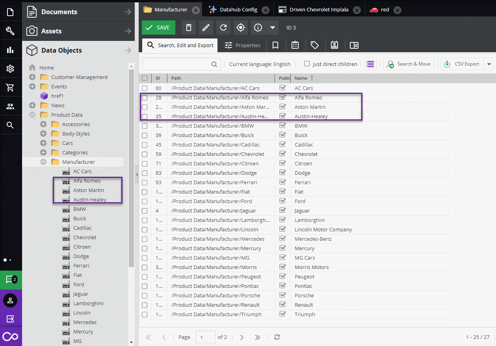

# Get Manufacturer Listing



### Request

Manufacturer listing with limit 3 and offset 1, sorted by name.

```graphql
{
  # 'first' is the limit
  # 'after' the offset
  getManufacturerListing(first: 3, after: 1, sortBy: "name") {
    edges {
      node {
        id
        name
        logo {
          id
          fullpath
        }
      }
    }
  }
}
```

### Response

```
{
  "data": {
    "getManufacturerListing": {
      "edges": [
        {
          "node": {
            "id": "28",
            "name": "Alfa Romeo",
            "logo": {
              "id": "290",
              "fullpath": "/Brand%20Logos/Alfa_Romeo_logo.png"
            }
          }
        },
        {
          "node": {
            "id": "240",
            "name": "Aston Martin",
            "logo": {
              "id": "291",
              "fullpath": "/Brand%20Logos/Aston_Martin_Logo_2018.png"
            }
          }
        },
        {
          "node": {
            "id": "35",
            "name": "Austin-Healey",
            "logo": {
              "id": "292",
              "fullpath": "/Brand%20Logos/Austin-Healey-Logo.jpg"
            }
          }
        }
      ],
      "totalCount": 27
    }
  }
}
```


