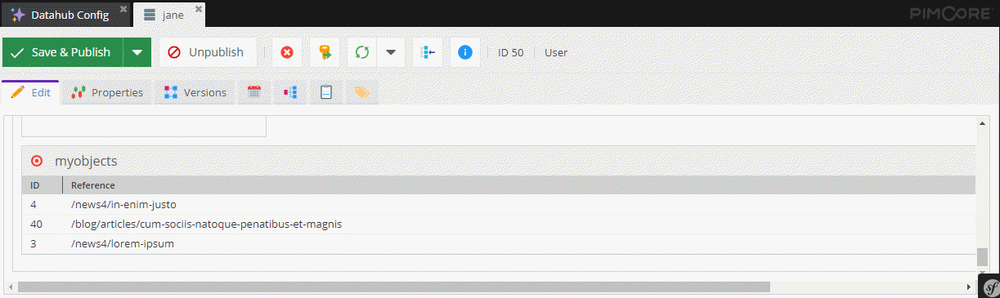

# Many-to-Many Object Relation



### Request

Get the associated categories.

```graphql
{
  getCar(id: 9) {
    name
    categories {
      ... on object_Category {
        id
        name
      }
    }
  }
}
```

### Response

```json
{
  "data": {
    "getCar": {
      "name": "E-Type",
      "categories": [
        {
          "id": "559",
          "name": "Sports Cars"
        },
        {
          "id": "555",
          "name": "Grand Tourer"
        }
      ]
    }
  }
}
```


