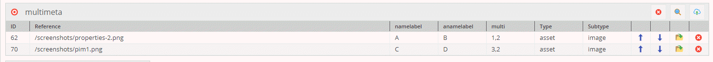

# Get Advanced Many-to-Many Relation Metadata



>TODO: Align this with the new demo as soon as reasonable content is available. 

### Request

News listing with limit 3 and offset 1
```
{
  getUser(id: 50) {
    # advanced many-to-many relation
    multimeta {
      element {
        ... on asset {
          fullpath
        }
      }
      metadata {
        name
        value
      }
    }
  }
}
```

### Response

```
{
  "data": {
    "getUser": {
      "multimeta": [
        {
          "element": {
            "fullpath": "/screenshots/properties-2.png"
          },
          "metadata": [
            {
              "name": "aname",
              "value": "B"
            },
            {
              "name": "multi",
              "value": "1,2"
            },
            {
              "name": "name",
              "value": "A"
            }
          ]
        },
        {
          "element": {
            "fullpath": "/screenshots/pim1.png"
          },
          "metadata": [
            {
              "name": "aname",
              "value": "D"
            },
            {
              "name": "multi",
              "value": "3,2"
            },
            {
              "name": "name",
              "value": "C"
            }
          ]
        }
      ]
    }
  }
}
```


