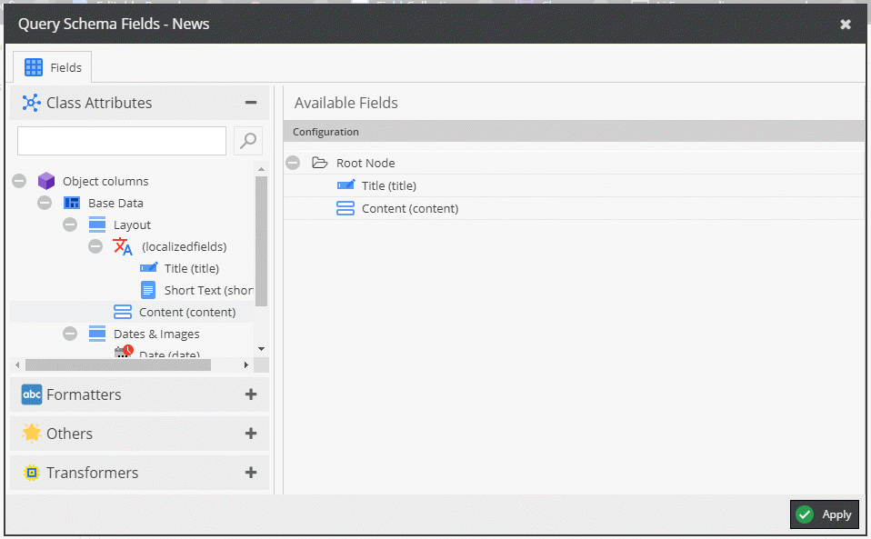
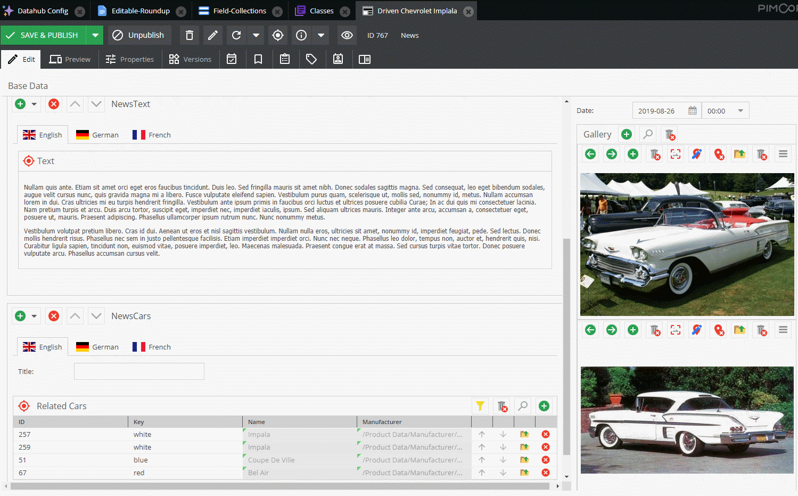
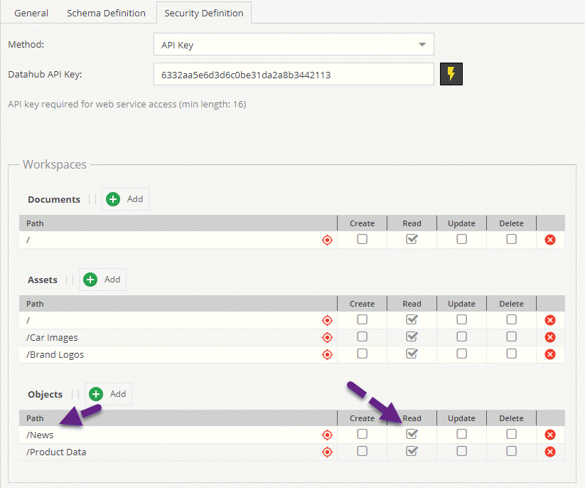

# Field-Collections on Data Objects

### Configuration

If you want to run this sample on the [Official Demo Site](https://demo.pimcore.fun), please create the following configuration



### Sample Data

Deeplink: https://demo.pimcore.fun/admin/login/deeplink?object_767_object



### Request

```graphql
{
{
  getNews(id: 767) {
    # id
    # title
    content {
      __typename      
      ... on fieldcollection_NewsText {
        text
      }
      ... on fieldcollection_NewsCars {
        title
        relatedCars {
          __typename
          ... on object_Car {
            name
            color
          }
        }
      }
    }
  }
}
```

and make sure that the `/News` folder is readable.



### Response

Here you also see the use of aliases.

```json
{
  "data": {
    "getNews": {
      "content": [
        {
          "__typename": "fieldcollection_NewsText",
          "text": "<p>Nullam quis ante. Etiam sit amet orci eget eros faucibus tincidunt. Duis leo. Sed fringilla mauris sit amet nibh. Donec sodales sagittis magna. Sed consequat, leo eget bibendum sodales, augue velit cursus nunc, quis gravida magna mi a libero. Fusce vulputate eleifend sapien. Vestibulum purus quam, scelerisque ut, mollis sed, nonummy id, metus. Nullam accumsan lorem in dui. Cras ultricies mi eu turpis hendrerit fringilla. Vestibulum ante ipsum primis in faucibus orci luctus et ultrices posuere cubilia Curae; In ac dui quis mi consectetuer lacinia. Nam pretium turpis et arcu. Duis arcu tortor, suscipit eget, imperdiet nec, imperdiet iaculis, ipsum. Sed aliquam ultrices mauris. Integer ante arcu, accumsan a, consectetuer eget, posuere ut, mauris. Praesent adipiscing. Phasellus ullamcorper ipsum rutrum nunc. Nunc nonummy metus.</p>\n\n<p>Vestibulum volutpat pretium libero. Cras id dui. Aenean ut eros et nisl sagittis vestibulum. Nullam nulla eros, ultricies sit amet, nonummy id, imperdiet feugiat, pede. Sed lectus. Donec mollis hendrerit risus. Phasellus nec sem in justo pellentesque facilisis. Etiam imperdiet imperdiet orci. Nunc nec neque. Phasellus leo dolor, tempus non, auctor et, hendrerit quis, nisi. Curabitur ligula sapien, tincidunt non, euismod vitae, posuere imperdiet, leo. Maecenas malesuada. Praesent congue erat at massa. Sed cursus turpis vitae tortor. Donec posuere vulputate arcu. Phasellus accumsan cursus velit.</p>\n"
        },
        {
          "__typename": "fieldcollection_NewsCars",
          "title": "XYZ",
          "relatedCars": [
            {
              "__typename": "object_Car",
              "name": "Impala",
              "color": [
                "white"
              ]
            },
            {
              "__typename": "object_Car",
              "name": "Impala",
              "color": [
                "white"
              ]
            },
            {
              "__typename": "object_Car",
              "name": "Coupe De Ville",
              "color": [
                "blue"
              ]
            },
            {
              "__typename": "object_Car",
              "name": "Bel Air",
              "color": [
                "red",
                "white"
              ]
            }
          ]
        }
      ]
    }
  }
}
```
