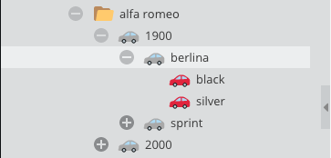

# Get objects Parent/Children/Siblings

For example, to get `berlina` object's (id:261) parent, children and siblings



### Request

Note that for `children` and `_siblings` you can use the `objectTypes` argument to filter for specific types.
Any combination of `variant`, `object`, `folder` is possible as a value for the `objectTypes` argument (default: `["object", "folder"]`).

```graphql
{
  getCar(id: 261) {
    id
    name

    parent {
      ... on object_Car {
        id
        name
      }
    }

    children(objectTypes: ["variant", "object"]) {
      ... on object_Car {
        id
        name
        color
      }
    }

    _siblings {
      ... on object_Car {
        id
        name
      }
    }
  }
}
```

### Response

```json
{
  "data": {
    "getCar": {
      "id": "261",
      "name": "1900",
      "parent": {
        "id": "260",
        "name": "1900"
      },
      "children": [
        {
          "id": "263",
          "name": "1900",
          "color": [
            "black"
          ]
        },
        {
          "id": "262",
          "name": "1900",
          "color": [
            "silver"
          ]
        }
      ],
      "_siblings": [
        {
          "id": "264",
          "name": "1900 Sprint"
        }
      ]
    }
  }
}
```
