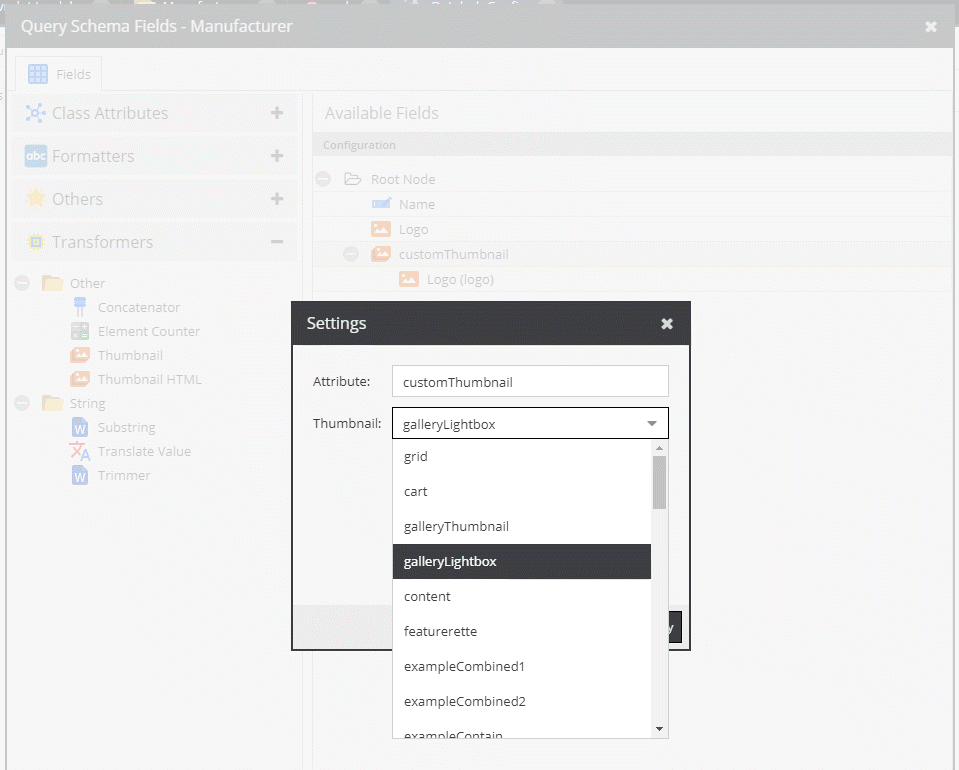

# Get Linked Data

## Get Car With Referenced Manufacturer and Manufacturer Logo Image Thumbnail

### Configuration

Deeplink: [https://demo.pimcore.fun/admin/login/deeplink?object_277_object](https://demo.pimcore.fun/admin/login/deeplink?object_277_object)

Note that you have to adapt your schema definition as depicted below. The thumbnail
will generated using the [Thumbnail Operator](../06_Operators.md). 



### Request

```graphql
{
  getCar(id:277, defaultLanguage:"en") {
    name
    frenchName: name(language: "fr")
    productionYear
    cylinders
    manufacturer {
      ...on object_Manufacturer {
        id
        name
        logo {
          fullpath
        }
        customThumbnail        
      }
    }
  }
  }
```

### Response

```json
{
  "data": {
    "getCar": {
      "name": "Montreal",
      "frenchName": null,
      "productionYear": 1970,
      "cylinders": 8,
      "manufacturer": {
        "id": "28",
        "name": "Alfa Romeo",
        "logo": {
          "fullpath": "/Brand%20Logos/Alfa_Romeo_logo.png",
          "filesize": 101613
        },
        "customThumbnail": "/Brand%20Logos/image-thumb__290__galleryLightbox/Alfa_Romeo_logo.webp"
      }
    }
  }
}
```