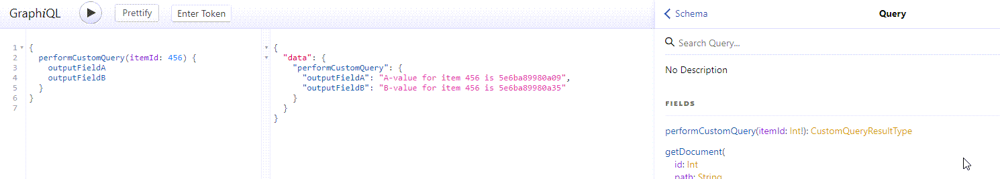

# Add a Custom Query

You can extend the query schema and add your custom query in the following way.

See [Events and Event Listeners](https://pimcore.com/docs/6.x/Development_Documentation/Extending_Pimcore/Event_API_and_Event_Manager.html)
if you need more information on Pimcore's event mechanism. 

```php
\Pimcore::getEventDispatcher()->addListener(\Pimcore\Bundle\DataHubBundle\Event\GraphQL\QueryEvents::PRE_BUILD,
    function (\Pimcore\Bundle\DataHubBundle\Event\GraphQL\Model\QueryTypeEvent $event) {
        $config = $event->getConfig();

        $outputType = new \GraphQL\Type\Definition\ObjectType([
                'name' => "CustomQueryResultType",
                'fields' => [
                    'outputFieldA' => [
                        'type' => \GraphQL\Type\Definition\Type::string(),
                        'resolve' => function ($source, $args, $context, \GraphQL\Type\Definition\ResolveInfo $info) {
                            return "A-value for item " . $source['resolvedId'] . " is " . uniqid();
                        }
                    ],
                    'outputFieldB' => [
                        'type' => \GraphQL\Type\Definition\Type::string(),
                        'resolve' => function ($source, $args, $context, \GraphQL\Type\Definition\ResolveInfo $info) {
                            return "B-value for item " . $source['resolvedId'] . " is " . uniqid();
                        }
                    ]
                ]
            ]
        );

        $operation = [
            'type' => $outputType,
            'args' => ['itemId' => ['type' => \GraphQL\Type\Definition\Type::nonNull(\GraphQL\Type\Definition\Type::int())]],
            'resolve' => function ($source, $args, $context, \GraphQL\Type\Definition\ResolveInfo $info) {
                // resolve the item using the input parameters. Result will be passed
                // to the field-level resolvers
                return ['resolvedId' => $args['itemId']];
            }
        ];

        $config['fields']['performCustomQuery'] = $operation;
        $event->setConfig($config);
    });
```



 
