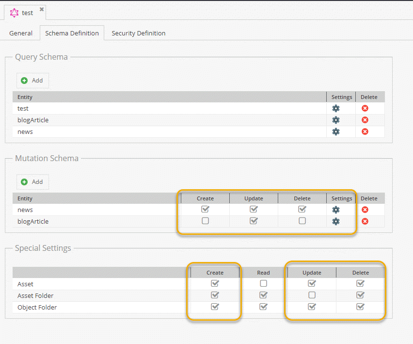

# DataObject Mutations

>TODO: Align this with the new demo as soon as reasonable content is available.
 
* Create Objects
* Update Objects
* Delete Objects

In addition, you can turn on mutations to modify assets, create object folders and on on.
 


 
Note that for `Create` and `Update` operate you can query the updated data using the same request.
Keep in mind that for all kinds of mutations you need the `Write` permission.

## Supported Mutation Datatypes


Also check out the Pimcore's [data type documentation](https://pimcore.com/docs/6.x/Development_Documentation/Objects/Object_Classes/Data_Types/index.html). 

* Boolean Select
* Checkbox
* Country
* Countries (Multiselect)
* Date
* DateTime
* Email
* External Image
* Field Collections
* Firstname
* Gender
* Geopoint
* Image
* ImageGallery
* Input
* Language
* Lastname
* Link
* Many-to-One Relation
* Many-to-Many Relation
* Many-to-Many Object Relation
* Advanced Many-to-Many Relation
* Advanced Many-to-Many Object Relation
* Multiselect
* Newsletter Active
* Newsletter Confirmed
* Numeric
* Quantity Value
* Select
* Slider
* Table
* Textarea
* Time
* Wysiwyg

## Supported Mutation Operators

* IfEmpty
* Locale Switcher
* ...

See [the overview page](./21_Mutation_Operators.md) for more details.

## Create Object

TBD: do we need an extra workspace permission for that ? (in addition to write which would be only used for updates)

Request:
```
mutation {
  createNews(parentId: 66, key: "testcreate27", published: false) {
    success
    message
    output(defaultLanguage: "de") {
      id      
      creationDate
      fullpath
      title(language: "en")
    }
  }
}
```

Response:
```
{
  "data": {
    "createNews": {
      "success": true,
      "message": "object created: 98",
      "output": {
        "id": "98",
        "creationDate": 1559642310,
        "fullpath": "/tests/testcreate2/testcreate27",
        "title": null
      }
    }
  }
}
```

## Update Object

Updates german title and short text and returns the modification date. 

Request:
```
mutation {
  updateNews(id: 773, defaultLanguage: "de", input: {title: "german TITLE", shortText: "new short text"}) {
    success
    output {
      modificationDate
    }
  }
}
```

Response:
```
{
  "data": {
    "updateNews": {
      "success": true,
      "output": {
        "modificationDate": 1559746654
      }
    }
  }
}
```

## Delete Object

Request:
```
mutation {
  deleteBlogCategory(id: 37) {
    success
    message
  }
}
```

Response:
```
{
  "data": {
    "deleteBlogCategory": {
      "success": true,
      "message": ""
    }
  }
}
```


## Extend Data Object Mutations
It is possible to add custom mutation data types and mutation operators. For details see detail documentation
pages: 
* [Add a custom mutation datatype](./25_Add_Custom_Mutation_Datatype.md)
* [Add a custom mutation operator](./26_Add_Custom_Mutation_Operator.md)


## More Examples
See following list for more examples with data object mutations:

- [Add Relations](./24_Mutation_Samples/10_Sample_Add_Relations.md)
- [Fieldcollection Mutations](./24_Mutation_Samples/15_Fieldcollection_Mutations.md)
