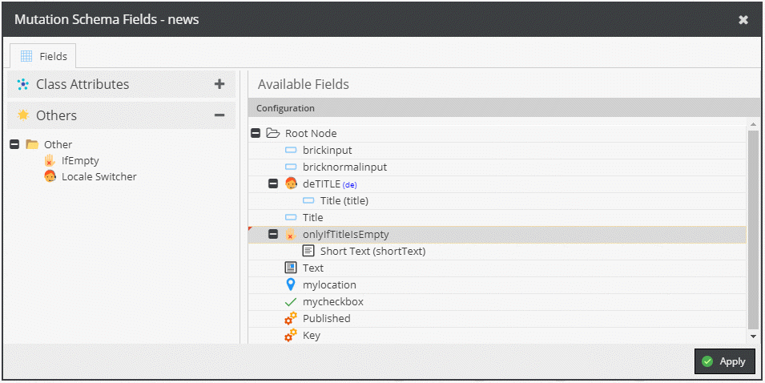

# Mutation Operators

Operators allow to modify and transform the data before it is stored in Pimcore.

#### IfNotEmpty

Only sets the value if current one is empty.

#### Locale Switcher

Switches to different language other than the default language.

#### Locale Collector

Allows editing all languages for a single field.
