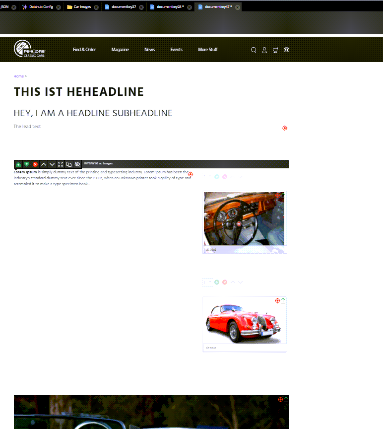

# [FreeForm] Create Document With Areablocks and Nested Block With Images

See demo document 99 for reference.

```graphql
mutation {
   createDocumentPage(
      key: "documentkey47"
      parentId: 1
      input: {
         editables: {
            areablock: [
               {
                  _editableName: "content"
                  indices: [
                     { key: "1", type: "headlines", hidden: false }
                     { key: "2", type: "wysiwyg-with-images", hidden: false }
                     { key: "3", type: "image", hidden: false }
                  ]
               }
            ]
            block: { _editableName: "content:2.images", indices: [1, 2] }
            image: [
               { _editableName: "content:3.image", alt: "alt text", id: 67 }
               {
                  _editableName: "content:2.images:1.image"
                  alt: "alt text for image 1"
                  id: 18
               }
               {
                  _editableName: "content:2.images:2.image"
                  alt: "alt text for image 2"
                  id: 22
               }
            ]
            input: [
               {
                  _editableName: "content:1.headline"
                  text: "HEY, I AM A SUBHEADLINE"
               }
               { _editableName: "headline", text: "THIS IS THE HEADLINE" }
            ]
            wysiwyg: [
               { _editableName: "content:1.lead", text: "The lead text" }
               {
                  _editableName: "content:2.content"
                  text: "<b>Lorem Ipsum</b> is simply dummy text of the printing and typesetting industry. Lorem Ipsum has been the industry's standard dummy text ever since the 1500s, when an unknown printer took a galley of type and scrambled it to make a type specimen book..."
               }
            ]
         }
         controller: "@AppBundle\\Controller\\ContentController"
         action: "default"
      }
   ) {
      success
      document {
         controller
         elements {
            __typename
         }
      }
   }
}
```

