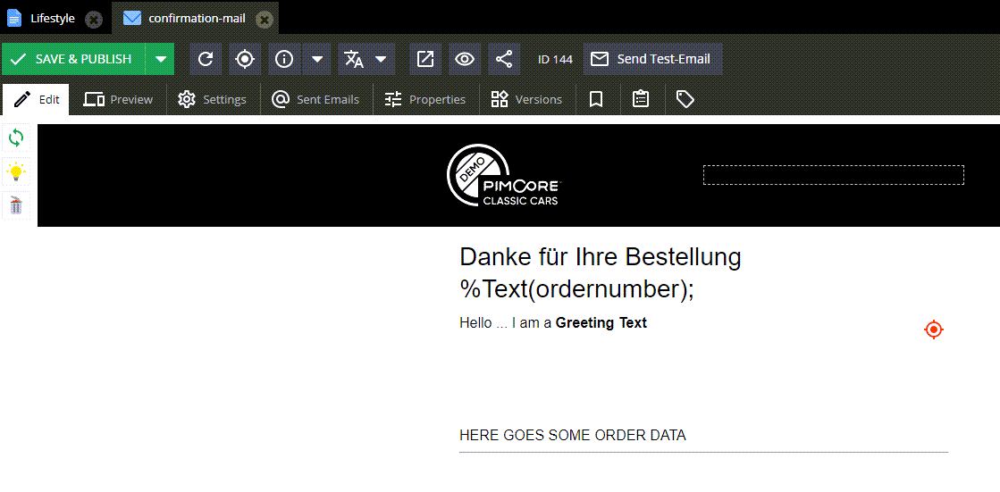

# [FreeForm] Update Email Document

See demo document 144 for reference.

```graphql
mutation {
   updateDocumentEmail(
      id: 144
      editableUpdateStrategy: replaceAll    # defaults to update
      input: {
         editables: {
            wysiwyg: [
               {
                  _editableName: "greeting_text"
                  text: "Hello ... I am a <b>Greeting Text</b>"
               }
            ]
         }
         subject: "Email subject"
      }
   ) {
      success
      document {
         controller
      }
   }
}
```

