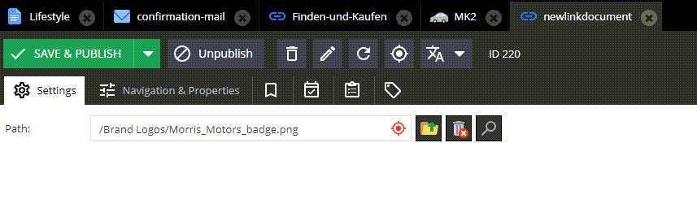

## [FreeForm] Create a new link document

```graphql
mutation {
  createDocumentLink(key: "newlinkdocument", parentId:1, input: {
    internal:308
    internalType:"asset"         
    }    
  
  ) {
    success
  }
}
```

