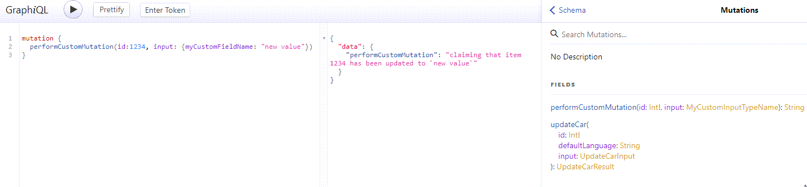

# Add Custom Mutations

You can extend the mutation schema and add your custom mutations in the following way.

See [Events and Event Listeners](https://pimcore.com/docs/6.x/Development_Documentation/Extending_Pimcore/Event_API_and_Event_Manager.html)
if you need more information on Pimcore's event mechanism. 

```php
\Pimcore::getEventDispatcher()->addListener(\Pimcore\Bundle\DataHubBundle\Event\GraphQL\MutationEvents::PRE_BUILD,
    function (\Pimcore\Bundle\DataHubBundle\Event\GraphQL\Model\MutationTypeEvent $event) {
        $config = $event->getConfig();

        $opName = "performCustomMutation";

        $inputType = new \GraphQL\Type\Definition\InputObjectType([
            'name' => "MyCustomInputTypeName",
            'fields' => [
                'myCustomFieldName' => [
                    'type' => \GraphQL\Type\Definition\Type::string()
                ]
            ]
        ]);

        $operation = [
            'type' => Type::string(),           // the result type
            'args' => [
                'id' => ['type' => Type::nonNull(\GraphQL\Type\Definition\Type::int())],
                'input' => ['type' => $inputType],
            ], 'resolve' => function ($source, $args, $context, \GraphQL\Type\Definition\ResolveInfo $info) {
                // do something here
                $id = $args['id'];
                return "claiming that item " . $id . " has been updated to `" . $args['input']['myCustomFieldName'] . "`";
            }

        ];

        $config['fields'][$opName] = $operation;
        $event->setConfig($config);
    });
```



 
