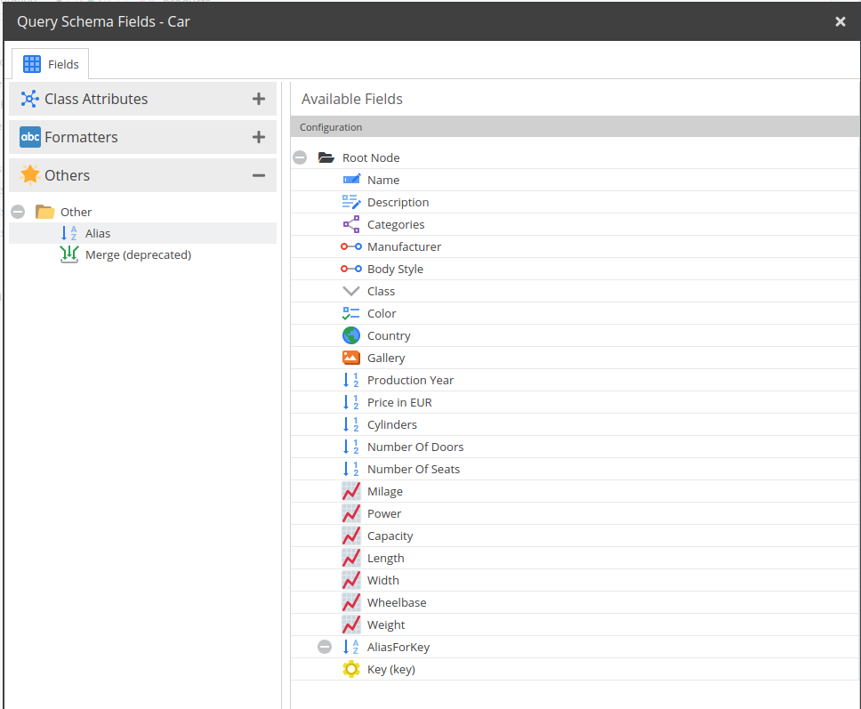

# Alias

Simply gives the child node a different name.

If you are looking for a way to directly use aliases in a GraphQL query, please see [Using Aliases](./11_Using_Aliases.md). 

## Configuration

**Attribute**: Add the new name for the field in this field.

## Example



In this example, the field `key` is renamed to `AliasForKey`. 

Request:
```graphql
{
  getPerson(id: 28) {
    AliasForKey
  }
}
```


