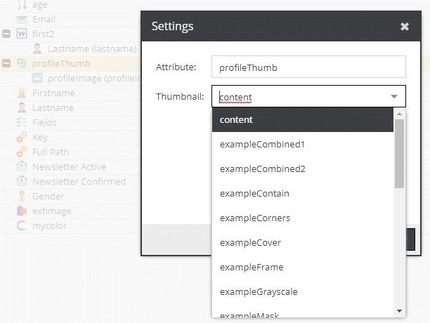

# Asset Thumbnail

Returns the selected thumbnail URL.
Add the operator to the list and drag & drop the desired image field into the operator.

## Configuration

- **Attribute**: Name for the field to use in the query
- **Thumbnail**: Select the desired thumbnail from the list.

## Example



Request:
```graphql
{
  getCar(id: 28) {
    id,    
    profileThumb
  }
}
```