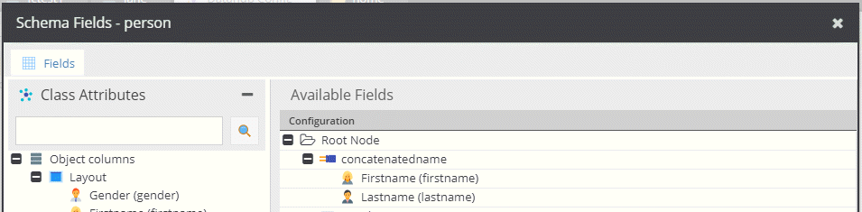

# Concatenator

Concatenates the values of the selected fields. 
Add the operator and drag & drop the desired fields into the operator.

## Configuration

- **Label**: Name for the field to use in the query.
- **Glue**: The string that will be used to concatenate the values.

## Example



Request:
```
{
  getCar(id: 28) {
    concatenatedname
  }
}
```