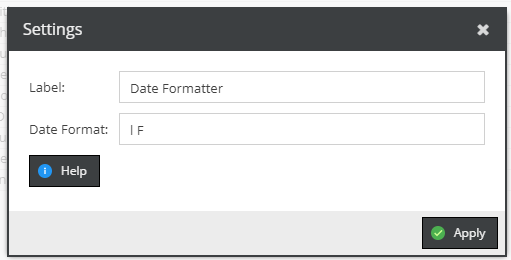

# Date Formatter

Utilizes the PHP date formatter. 
Add the operator to the list and drag & drop the desired field into the operator.

## Configuration

- **Label**: Value that gets displayed in the right panel.
- **Date Format**: The format you want to use. For formatting options see [PHP Date Format](https://www.php.net/manual/en/function.date.php).

## Example



Request:
```graphql
{
  getCar(id: 28) {
    id,
    modificationDate
  }
}
```