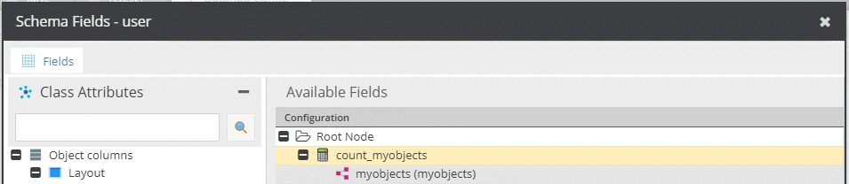

#  Element Counter

Counts the elements assigned to the selected field. 
Add the operator to the list and drag & drop the desired fields into the operator.
Useful for counting the number of elements in a relation field.

## Configuration

No configuration available.

## Example



Request:
```
{
  getCar(id: 28) {
    count_myobjects
  }
}
```