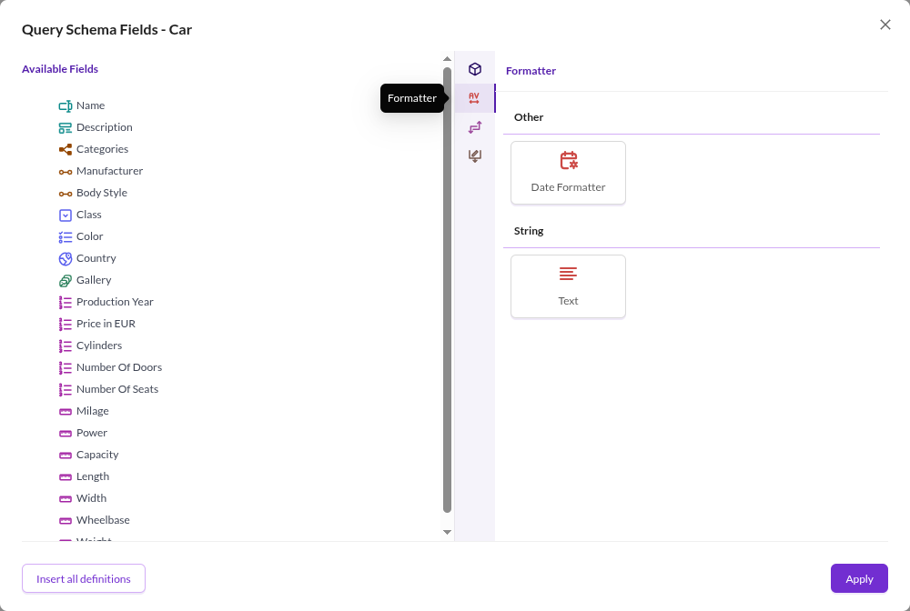

# Operators

Operators allow to modify and transform the data before it is delivered to the endpoint or stored in Pimcore,
depending on whether they are used in a query or a mutation.

Operators are selected in the `Schema Definition` tab of a GraphQL configuration.
In the `Query Schema` section, use the gear icon to open the field configuration dialog for a data object class used in
queries. The `Mutation Schema` section works the same way for classes used in mutations.

The dialog lists the exported fields under **Available Fields** on the left. The panel on the right has a vertical icon
strip: the first icon shows the class attributes, and the others group the operators. The query schema offers
**Formatter**, **Transformer** and **Other** in that order; the mutation schema offers **Other** only.

Add an operator by dragging it onto the **Available Fields** side. Depending on the operator, an options dialog opens
where you configure it. After adding an operator, drag fields under it to apply the operator to them.

See the pages in this chapter for the available operators.
