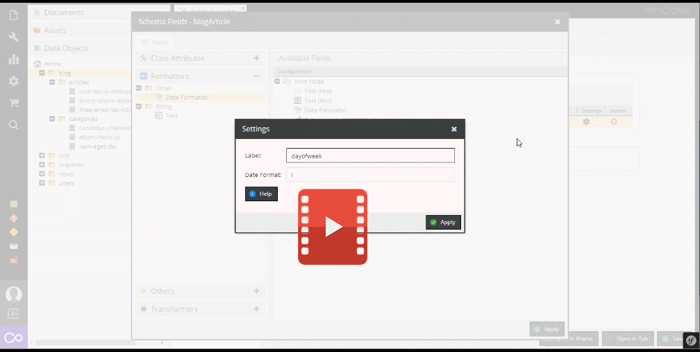
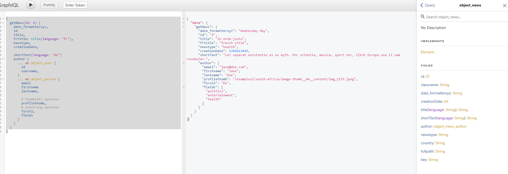
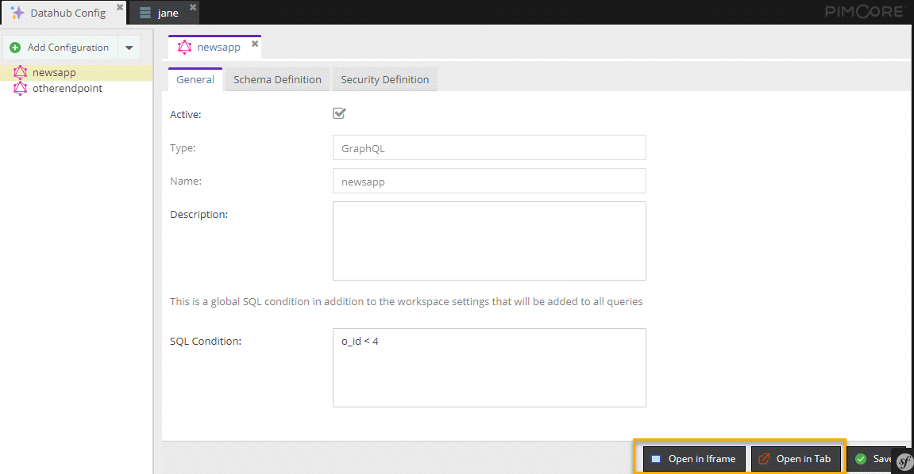
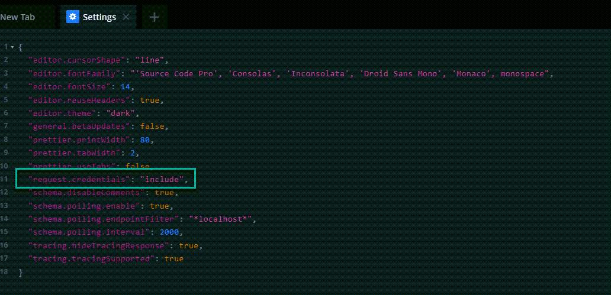

#  GraphQL 

<!-- This GraphQL extension of Pimcores Datahub makes Assets and Data Objects available through an organized and easy-to-query GraphQL schema and constitutes a powerful and flexible way to connect Pimcore to other systems or frontend applications. -->

With [GraphQL](https://graphql.org/) endpoints, Datahub allows integrating Pimcore to other systems 
and services via GraphQL and test them with the integrated 
[GraphiQL explorer](https://github.com/graphql/graphiql/tree/main/packages/graphiql#readme) tool right away. 

[](../img/graphql/intro.mp4)




## Configuration
Configuration takes place in the endpoint configuration and offers following possibilities: 
- [General Settings](./01_Configuration/01_General_Settings.md)
- [Schema Definition](./01_Configuration/02_Schema_Settings.md)
- [Security Settings](./01_Configuration/03_Security_Settings.md)
- [Custom Permissions](./01_Configuration/04_Custom_Permissions.md)

## External Access
The standard endpoint is
```
/pimcore-graphql-webservices/{configurationname}?apikey={yourApiKey}
```
So if your configuration name is blogdemo and your apikey 123456 then your endpoint would be
```
/pimcore-graphql-webservices/blogdemo?apikey=123456
```
Here is a configuration how to [override the standard endpoint](./01_Configuration/15_Customize_Endpoint_URL.md)

## Queries
Depending on the configuration, the endpoint provides several queries to fetch data from Pimcore. As 
Datahub always creates a proper graphQL schema, also have a look at the generated schema to get details
for the possible queries of a certain endpoint. 

On the following pages certain generic aspects are explained, and a couple of samples are listed: 
* For details on Document queries see [Document Query Documentation](./04_Query/01_Document_Queries.md).
* For details on Asset queries see [Asset Query Documentation](./04_Query/04_Asset_Queries.md).
* For details on DataObjects queries see [DataObject Query Documentation](./04_Query/05_DataObject_Queries.md).
* For details on how to add custom queries see [Add Custom Queries Documentation](./04_Query/20_Add_Custom_Query.md).


## Mutations
Depending on the configuration, the endpoint provides several mutations to update data in Pimcore. As 
Datahub always creates a proper graphQL schema, also have a look at the generated schema to get details
for the possible mutations of a certain endpoint. 

See following pages for a general overview of possible mutations:
- For details on Document mutations see [Document Mutation Documentation](./07_Mutation/01_Document_Mutations.md)
- For details on Asset mutations see [Asset Mutation Documentation](./07_Mutation/04_Asset_Mutations.md)
- For details on DataObject mutations see [DataObject Mutation Documentation](./07_Mutation/20_DataObject_Mutations.md)  
- For details on how to add custom mutations see [Add Custom Mutations Documentation](./07_Mutation/27_Add_Custom_Mutations.md).


## Hands-On-Testing Using GraphiQL Explorer
[GraphiQL explorer](https://github.com/graphql/graphiql/tree/main/packages/graphiql#readme) can be opened
for an endpoint in an iframe within Pimcore or as an additional browser tab. 




## Events
It is possible to customize default behavior of graphQL endpoint with event listeners. For details 
see [Events Documentation](./10_Events.md). 


## Output Cache
It is possible to keep a cache of the responses delivered by the endpoint, using the same default cache backend configured for Pimcore (Doctrine, Redis,...). This is specially useful to speed up the endpoint replies when it produces complex responses with many dependencies.

The cache can be enabled and configured with a configuration entry like this in your `config.yml` file:
```yml
#### DATAHUB OUTPUT CACHE
pimcore_data_hub:
    graphql:
        output_cache_enabled: true    # Enables/disables the output (responses) cache
        output_cache_lifetime: 20     # If enabled, for how many seconds each response will be cached
```
By default the cache is disabled but if it is enabled and you don't specify a value for `output_cache_lifetime`, its default value is set to 30 seconds.

### Disable Output Cache for a Single Request (Only in DEBUG MODE)
Just add the parameter `?pimcore_outputfilters_disabled=true` to the URL. This works in a similar way as the [Pimcore's Full Page Cache](https://pimcore.com/docs/pimcore/current/Development_Documentation/Development_Tools_and_Details/Cache/Full_Page_Cache.html).

### Customize the Cache Behaviour
It is possible to customize some behavior of output cache with event listeners. For details 
see [Events Documentation](./10_Events.md).

### Note on Debugging With iGraplQL Playground

Open the settings and change `request.credentials` to `include`. Otherwise the 
`XDEBUG_SESSION` cookie header will get removed by default.


