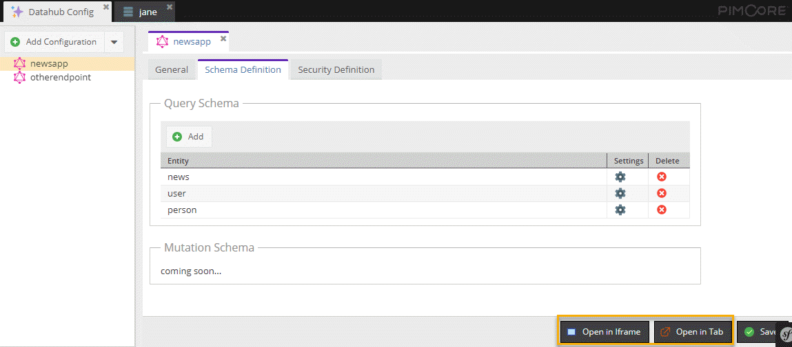
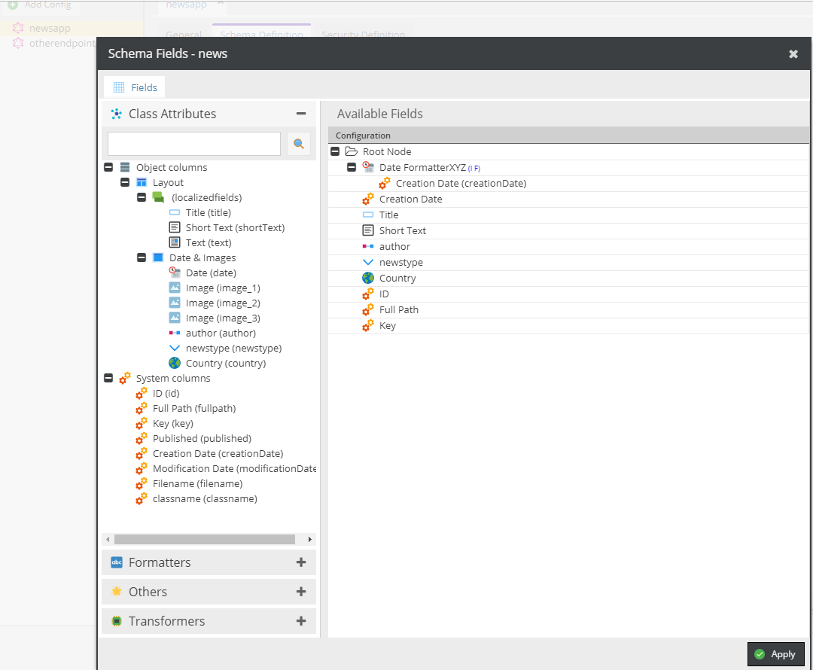

## Get News Object with referenced author + profile image thumbnail

### Configuration

Configurations Overview


Configuration Tab



Schema Definition



### GraphQL Explorer


### Request

```
{
  getNews(id: 4) {
    date_formatterxyz,
    id
    title,
    frtitle: title(language: "fr"),
    newstype,
    creationDate,
  
    shortText(language: "de")
    author {
      ... on object_user {
        id
        username,
      }
      ... on object_person {
        email
        firstname
        lastname,    
        
        # thumbnail operator
        profilethumb,
        # substring operator
        first2,
        fields
      }
    }
  }
}
```

### Response

```
{
  "data": {
    "getNews": {
      "date_formatterxyz": "Wednesday May",
      "id": "4",
      "title": "In enim justo",
      "frtitle": "french title",
      "newstype": "health",
      "creationDate": 1368613645,
      "shortText": "Lor separat existentie es un myth. Por scientie, musica, sport etc, litot Europa usa li sam vocabular.",
      "author": {
        "email": "jane@doe.com",
        "firstname": "Jane",
        "lastname": "Doe",
        "profilethumb": "/examples2/south-africa/image-thumb__44__content/img_2133.jpeg",
        "first2": "Do",
        "fields": [
          "politics",
          "entertainment",
          "health"
        ]
      }
    }
  }
}
```


