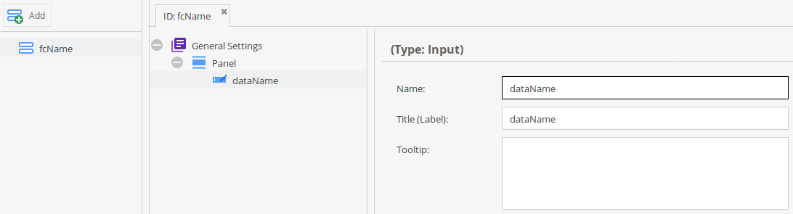
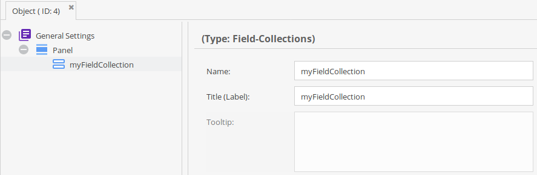

## Field-Collections on Data Objects

Data Models:





### Request

```graphql
{
  getObject(id: 50) {
    myFieldCollection {
      ... on fieldcollection_fcName {
        dataName
      }
    }
  }
}
```

### Response

Here you also see the use of aliases.

```
{
  "data": {
    "getObject": {
      "myFieldCollection": [
        {
          "dataName": "Your value here"
        },
        {
          "dataName": "The second value"
        }
      ]
    }
  }
}
```
